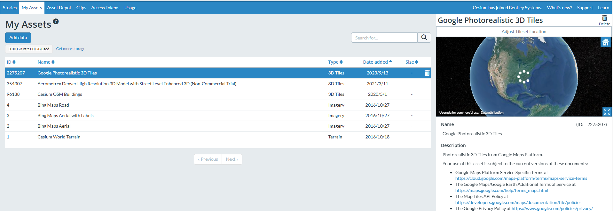
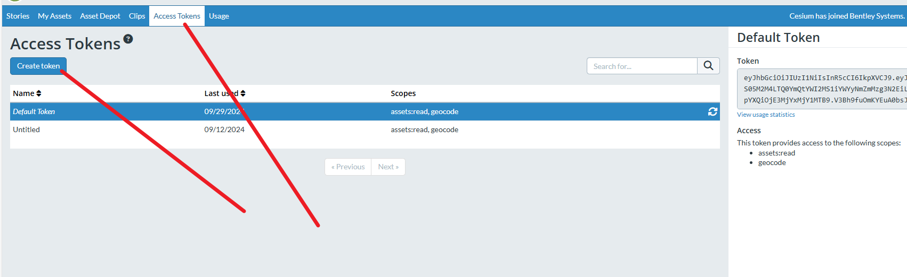

cesium渲染3DTiles模型和glb模型


相关网站：

1.快速入门：https://cesium.com/learn/cesiumjs-learn/cesiumjs-quickstart/

2.webpack配置：https://github.com/CesiumGS/cesium-webpack-example#cesium-webpack-example

3.说明文档（找中文文档请看清楚人家的版本和你下载的版本！大坑）：https://cesium.com/learn/cesiumjs/ref-doc/

4.实例地址：https://sandcastle.cesium.com/?src=3D%20Tiles%20Feature%20Styling.html

5.模型文件下载：https://blog.csdn.net/lu6545311/article/details/142628319?spm=1001.2014.3001.5502

6.demo的下载（也有模型文件）：https://github.com/ljy-110/vue-cesium-model/tree/main/vue2-cesium-model

一、安装cesium

1.安装cesium

1.1 NPM 安装

```js
npm install cesium
```

1.2 CDN引入

```html
<script src="https://cesium.com/downloads/cesiumjs/releases/1.121/Build/Cesium/Cesium.js"></script>
<link href="https://cesium.com/downloads/cesiumjs/releases/1.121/Build/Cesium/Widgets/widgets.css" rel="stylesheet">
```

二、获取token

登录注册cesium（https://ion.cesium.com/signin/），进入个人中心



然后创建token



三、安装拿到token之后，我们开始运行，先把地球给搞出来先

因为我测试的，所以直接使用了CDN的引入

```html
<div id="Model" ref="mapDiv" class="divTdtMap" style="height:100%;width:100%;margin:auto;"></div>
```

```js
Cesium.Ion.defaultAccessToken = "";  //放你的token
viewer = new Cesium.Viewer("Model", {  
        homeButton: false,
        sceneModePicker: false,
        baseLayerPicker: false, // 影像切换
        animation: false, // 是否显示动画控件
        infoBox: false, // 是否显示点击要素之后显示的信息
        selectionIndicator: false, // 要素选中框
        geocoder: false, // 是否显示地名查找控件
        timeline: false, // 是否显示时间线控件
        fullscreenButton: false,
        shouldAnimate: false,
        navigationHelpButton: false, // 是否显示帮助信息控件
});
      // 隐藏版权
      viewer._cesiumWidget._creditContainer.style.display = "none";
```

最终的展示效果，出现一个地球


四、开始渲染3DTiles模型

4、模型的来源可以去看看的另一个文章（测试使用的是香港地区的模型）

https://blog.csdn.net/lu6545311/article/details/142628319?spm=1001.2014.3001.5502

```js
let tilesetUrl = '/model/tile_20_27_CESIUM/tileset.json'  //模型地址这是本地的，如果是服务器的就直接把路径放进来就行了
      let property = {
        skipLevelOfDetail: true,
        maximumScreenSpaceError: 16,
        cullWithChildrenBounds: true,
        baseScreenSpaceError: 100, // 基本屏幕错误阈值
        skipScreenSpaceErrorFactor: 16, // 跳过屏幕错误因子
        skipLevels: 3, // 跳过的层数
        immediatelyLoadDesiredLevelOfDetail: false, // 是否立即加载所需的细节级别
        loadSiblings: false, // 是否加载同级别的其他3DTiles
      }
      tileset = await Cesium.Cesium3DTileset.fromUrl(tilesetUrl, property);
      // 加载完成的回调
      // tileset.allTilesLoaded.addEventListener(function() {
      //     console.log('All tiles are loaded');
      // });
      viewer.scene.primitives.add(tileset);
      //加载完成后缩放到模型位置
      viewer.zoomTo(tileset);
```

直接展示模型，会发现这个模型视角太大了，看到的模型距离很近


4.2  所以我们要通过调整摄像头来达到我们想要的效果

```js
viewer.camera.flyTo({
        // fromDegrees()方法，将经纬度和高程转换为世界坐标，这里定位到渔港
        destination: Cesium.Cartesian3.fromDegrees(114.15877963610748, 22.276363621909915, 500.0),
        orientation: {
          // heading: Cesium.Math.toRadians(0),// 指向
          pitch: Cesium.Math.toRadians(-30),// 视角
          roll: 0.0,
        },
      });
```

最后效果如下


4.3 在调试的时候发现这个很麻烦，很难调整，特别是改变了高度或者视角，旋转都会导致其他的效果不一样，所以可以使用下面的方法来调整他们的位置，拿到对应的数据

```js
//camera.moveEnd  摄像头移动结束后的回调  
viewer.camera.moveEnd.addEventListener(function() {  
          // 获取相机当前的位置（笛卡尔坐标）  
          var cartesian = viewer.camera.positionCartographic;  
          // 转换为经纬度和高度的对象  
          var longitude = Cesium.Math.toDegrees(cartesian.longitude);  
          var latitude = Cesium.Math.toDegrees(cartesian.latitude);  
          var height = cartesian.height;
    		console.log('经纬度：', longitude, latitude);  
    		console.log('高度：', height);  
          // 获取相机的朝向和俯仰角  
          var heading = Cesium.Math.toDegrees(viewer.camera.heading);  
          var pitch = Cesium.Math.toDegrees(viewer.camera.pitch);  
          var roll = Cesium.Math.toDegrees(viewer.camera.roll);
    	console.log('朝向（度）：', heading);
    	console.log('俯仰角（度）：', pitch);
    	console.log("（翻滚角）:",roll);
});
```

4.4 允许缩放的范围

```js
// 最小缩放高度（米）
      viewer.scene.screenSpaceCameraController.minimumZoomDistance = 100;
      // 最大缩放高度（米）
      viewer.scene.screenSpaceCameraController.maximumZoomDistance = 10000;
```


五、在这个基础上，再渲染一个glb模型，飞机模型在上空展示

模型文件看相关地址

```js
let modelUrl = '/model/Airplane.glb'
      // 创建一个Entity  
      let entity = new Cesium.Entity({
        name: '飞机',
        position: Cesium.Cartesian3.fromDegrees(114.158025, 22.282767, 200.0), // 设置模型的位置  
        model: {
          uri: modelUrl,
          scale: 30.0, // 根据需要调整模型大小  
          // minimumPixelSize: 128,
          // maximumScale: 20000  
        },
      });
      // 将Entity添加到Cesium Viewer的entities集合中  
      viewer.entities.add(entity);
```

最新效果


六、cesium的地图改成天地图

```js
const tianditu = new Cesium.WebMapTileServiceImageryProvider({
        url: 'http://{s}.tianditu.gov.cn/img_w/wmts?service=wmts&request=GetTile&version=1.0.0&LAYER=img&tileMatrixSet=w&TileMatrix={TileMatrix}&TileRow={TileRow}&TileCol={TileCol}&style=default&format=tiles&tk=你的ak',
        layer: 'img_w',
        style: 'default',
        format: 'tiles',
        tileMatrixSetID: 'w',
        subdomains:['t0','t1','t2','t3','t4','t5','t6','t7'],
        maximumLevel: 18,
        credit: new Cesium.Credit('天地图'),
      })  

      // 将天地图层添加到观众实例的影像图层集合中
      viewer.imageryLayers.addImageryProvider(tianditu)
```


七、地图添加地点的文字标注提示

```js
viewer.imageryLayers.addImageryProvider(
        new Cesium.WebMapTileServiceImageryProvider({
          url:
            "http://{s}.tianditu.gov.cn/cva_c/wmts?service=wmts&request=GetTile&version=1.0.0" +
            "&LAYER=cva&tileMatrixSet=c&TileMatrix={TileMatrix}&TileRow={TileRow}&TileCol={TileCol}" +
            "&style=default&format=tiles&tk=你的ak",
          layer: "vec_w",
          style: "default",
          format: "tiles",
          tileMatrixSetID: "w",
          subdomains: ["t0", "t1", "t2", "t3", "t4", "t5", "t6", "t7"],
          tilingScheme: new Cesium.GeographicTilingScheme(),
          tileMatrixLabels: [ "1", "2", "3", "4", "5", "6", "7", "8", "9", "10", "11", "12", "13", "14", "15", "16", "17", "18", "19", ],
          maximumLevel: 18,
          show: false,
        })
      );
```

