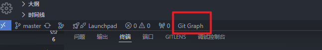

git单独把某个提交合并到其他分支

使用vscode来进行操作

按照vscode插件，`Git Graph`



先切换到你想要合并到的分支，然后点击上面的插件，再出来的记录，点击你想要合并过去的记录，拿到对应的`**Commit**`


然后在终端输入

```js
git cherry-pick 'Commit'

//比如
git cherry-pick b8bba887837bd83a88d184d68dbf7a9c08ac0507

//最后输入(取决于当前没有其他的提交和冲突，如果有的话，先处理)
git add .
```

