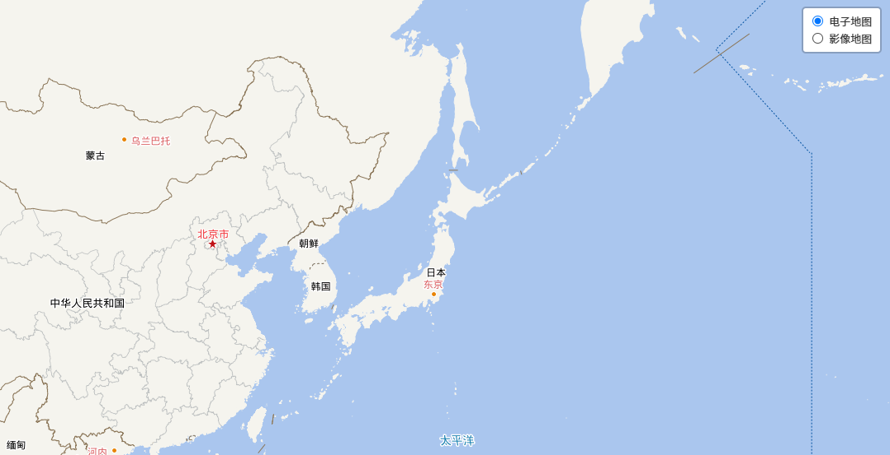
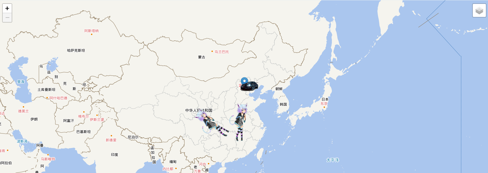
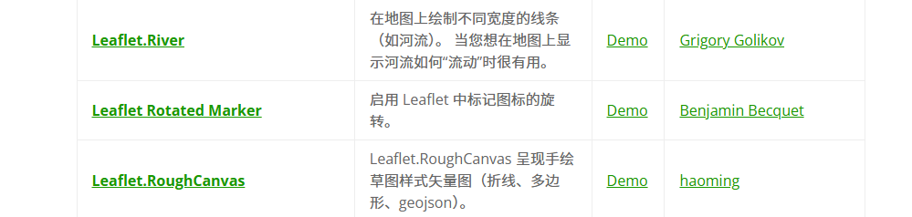
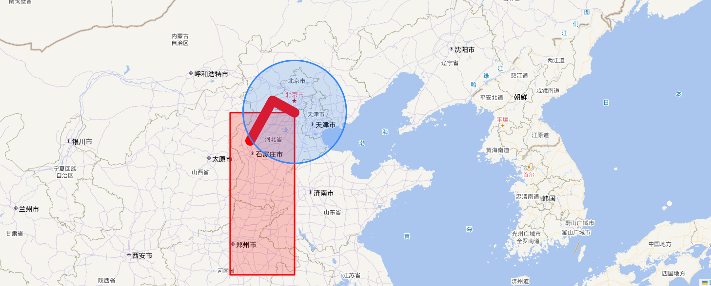

leaflet的使用

Leaflet.js允许开发者在网页上轻松集成交互式地图，并提供了一系列功能，如标记、多边形、弹出层等，使开发者能够与地图进行交互。无论是展示位置、绘制路线，还是创建动态地图，Leaflet.js都提供了强大的工具。

亮点
轻量级：Leaflet.js非常轻巧，文件大小小，加载速度快，适合在移动设备上使用。这一特点使得它在网络较慢的环境下也能表现出色。
易用性：Leaflet.js提供了简单易用的API，使得在地图上创建标记、弹出窗口等变得非常容易。这使得无论是初学者还是经验丰富的开发者都能快速上手。
可定制性：Leaflet.js支持自定义地图样式、图标、弹出窗口内容等，可以根据需求进行灵活定制。此外，它还支持插件系统，开发者可以根据需要扩展地图功能。
兼容性：Leaflet.js兼容各种现代浏览器，并且支持移动设备的触摸操作。这使得它能够在多种设备上提供一致的用户体验。
丰富的功能：除了基本的地图展示功能外，Leaflet.js还支持缩放、平移、图层控制等交互功能。此外，通过引入动画插件等扩展，还可以实现更加丰富的动态效果。
强大的社区支持：Leaflet.js拥有庞大的开发者社区，提供了丰富的插件和扩展，可以满足各种地图需求。社区中的开发者们不断贡献新的想法和解决方案，使得Leaflet.js的功能不断完善和扩展。

安装使用

```js
// CDN
<link rel="stylesheet" href="https://unpkg.com/leaflet@1.9.3/dist/leaflet.css" integrity="sha256-kLaT2GOSpHechhsozzB+flnD+zUyjE2LlfWPgU04xyI=" crossorigin="" />
<script src="https://unpkg.com/leaflet@1.9.3/dist/leaflet.js" integrity="sha256-WBkoXOwTeyKclOHuWtc+i2uENFpDZ9YPdf5Hf+D7ewM=" crossorigin=""></script>

// npm
npm install leaflet

//源码
https://github.com/Leaflet/Leaflet
```


初始化地图

```js
init() {
  let center = [39.871534, 116.395645];
  let zoom = 4;
  const that = this;
  this.map = L.map(
    "map",
    { crs: L.CRS.EPSG3857, minZoom: 4, maxZoom: 18, doubleClickZoom: false }
  ).setView(center, zoom);
  const tiandiKey = "";
  const imageURL1 =
    "http://t0.tianditu.gov.cn/vec_w/wmts?" +
    "SERVICE=WMTS&REQUEST=GetTile&VERSION=1.0.0&LAYER=vec&STYLE=default&TILEMATRIXSET=w&FORMAT=tiles" +
    "&TILEMATRIX={z}&TILEROW={y}&TILECOL={x}" +
    "&tk=" +
    tiandiKey;
  let layer1 = L.tileLayer(imageURL1, {
    attribution: "电子地图",
  }).addTo(this.map)
},
```

切换地图的类型（电子地图、影像地图），工具类型

```js
applyLayer(map, type) {
      const tiandiKey = "";
      const imageURL1 =
        "http://t0.tianditu.gov.cn/vec_w/wmts?" +
        "SERVICE=WMTS&REQUEST=GetTile&VERSION=1.0.0&LAYER=vec&STYLE=default&TILEMATRIXSET=w&FORMAT=tiles" +
        "&TILEMATRIX={z}&TILEROW={y}&TILECOL={x}" +
        "&tk=" +
        tiandiKey;
      let layer1 = L.tileLayer(imageURL1, {
        attribution: "电子地图",
      })
      const imageURL2 =
        "http://t0.tianditu.gov.cn/cva_w/wmts?" +
        "SERVICE=WMTS&REQUEST=GetTile&VERSION=1.0.0&LAYER=cva&STYLE=default&TILEMATRIXSET=w&FORMAT=tiles" +
        "&TILEMATRIX={z}&TILEROW={y}&TILECOL={x}" +
        "&tk=" +
        tiandiKey;
      let layer2 = L.tileLayer(imageURL2, {
        attribution: "注记",
      }).setZIndex(999);

      let imageURL3 =
        "http://t0.tianditu.gov.cn/img_w/wmts?" +
        "SERVICE=WMTS&REQUEST=GetTile&VERSION=1.0.0&LAYER=img&STYLE=default&TILEMATRIXSET=w&FORMAT=tiles" +
        "&TILEMATRIX={z}&TILEROW={y}&TILECOL={x}" +
        "&tk=" +
        tiandiKey;
      let layer3 = L.tileLayer(imageURL3, {
        attribution: "影像地图",
      });

      var layerGroup1 = L.layerGroup();
      var layerGroup2 = L.layerGroup();

      layerGroup1.addLayer(layer1);
      layerGroup1.addLayer(layer2);

      layerGroup2.addLayer(layer3);
      layerGroup2.addLayer(layer2);

      if (type == 1) {
        layerGroup1.addTo(map);
      } else {
        layerGroup2.addTo(map);
      }
      var baseLayers = {
        电子地图: layerGroup1,
        影像地图: layerGroup2,
      };

      this.layerControl = L.control.layers(
        baseLayers,
        {},
        {
          collapsed: true,
          hideSingleBase: true,
        }
      );
      this.layerControl.addTo(map);
    },
```



添加marker、自定义marker

```js
// 添加默认的点
var marker = L.marker([39.891534, 116.395645]).addTo(this.map);
this.markerCustom.push(marker);

// 添加自定义icon的marker
applyMarker2() {
      const shipIcon = L.icon({
        iconUrl: require('./car.png'),
        iconSize: [64, 32],
        iconAnchor: [16, 32],
        popupAnchor: [0, -32]
      });
      const shipIcon2 = L.icon({
        iconUrl: require('./m.png'),
        iconSize: [64, 130],
        iconAnchor: [16, 32],
        popupAnchor: [0, -32]
      });
      var marker1 = L.marker([39.491534, 116.395645], { icon: shipIcon}).addTo(this.map);
      var marker2 = L.marker([34.491534, 113.395645], { icon: shipIcon2}).addTo(this.map);
      var marker2 = L.marker([31.491534, 103.395645], { icon: shipIcon2,rotationAngle: 300}).addTo(this.map);
      this.markerCustom.push(marker1);
      this.markerCustom.push(marker2);
      marker1.on('click', () => {
        this.$message({
          message: '点击了车辆',
          type: 'success'
        });
      });
      const popupContent = '<p>这是一个动漫</p>';
      const popup = L.popup({ autoClose: true, }).setContent(popupContent);
      marker2.bindPopup(popup);
      marker2.on('click', (event) => {
        // 获取marker的经纬度
        var markerLatLng = event.latlng;
        // 设置地图中心为marker的位置
        this.map.setView(markerLatLng, this.map.getZoom() + 10); // 放大两级
        this.$message({ message: '点击了动漫，放大了地图，改变了中心位置', type: 'success' });
      });
    },
        
// 清除 marker
clearMarker() {
    for (let i = 0; i < this.markerCustom.length; i++) {
    	this.markerCustom[i].remove();
    }
    this.markerCustom = [];
},
```



leaflet本身没有让icon旋转的参数，所以就得单独再安装一个插件`leaflet.rotatedMarker`

```js
// 地址
https://github.com/bbecquet/Leaflet.RotatedMarker

//使用
L.marker([31.491534, 103.395645], { icon: shipIcon2,rotationAngle: 300}).addTo(this.map);
```



添加多边形

```js
applyPolygon() {
      // 从一个 LatLng 点的数组中创建一个红色的多边形
      let latlngs = [[37, -109.05], [41, -109.03], [41, -102.05], [37, -102.04]];
      let polygon = L.polygon(latlngs, { color: 'red' }).addTo(this.map);
      // 将地图放大到多边形的位置
      this.map.fitBounds(polygon.getBounds());
},
```

添加圆

```js
applyCircle() {
      L.circle([39.491534, 116.395645], {radius: 200000}).addTo(this.map);
      this.map.setView([39.491534, 116.395645], this.map.getZoom()); // 放大两级
},
```

添加折线

```js
applyPolyline() {
      var latlngs = [
        [45.51, -122.68],
        [37.77, -122.43],
        [34.04, -118.2]
      ];
      var polyline = L.polyline(latlngs, { color: 'red',weight:20 }).addTo(this.map);
      this.map.fitBounds(polyline.getBounds());
      this.map.setView([45.51, -122.68], this.map.getZoom()); // 放大两级
},
```

添加矩形

```js
applyRectangle() {
      var rectangle = L.rectangle([[40.712, -74.227], [40.774, -74.125]], { color: 'red' }).addTo(this.map);
      this.map.fitBounds(rectangle.getBounds());
      this.map.setView([40.712, -74.227], this.map.getZoom()); // 放大两级
}
```

