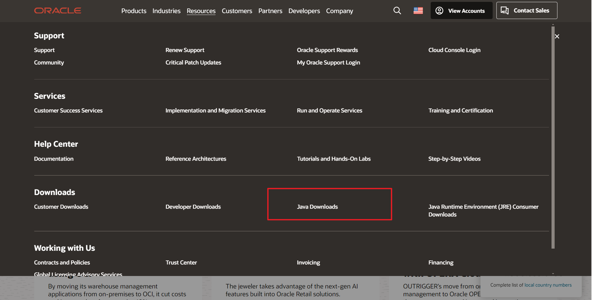
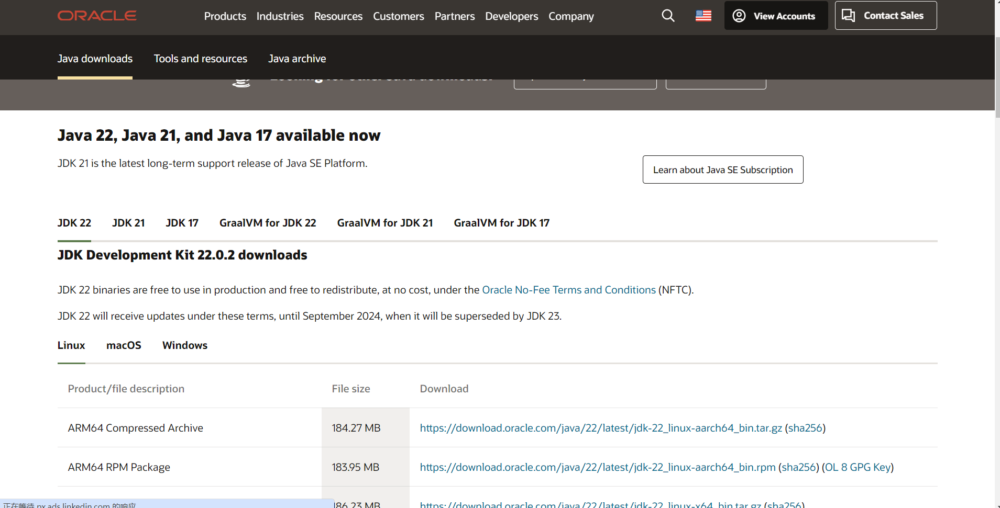
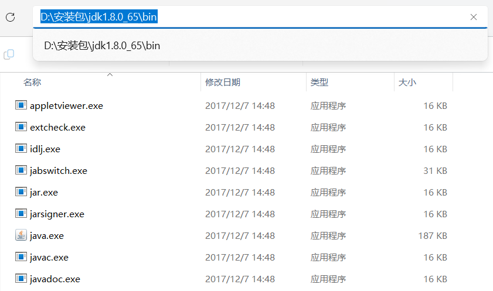
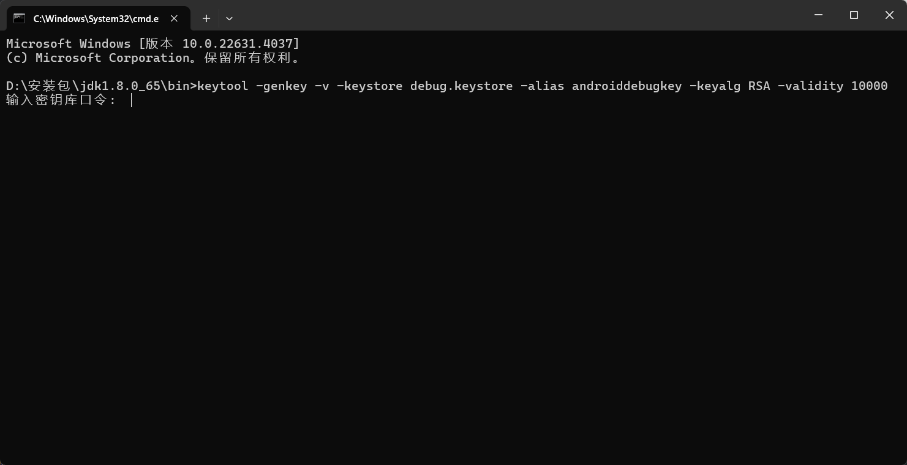
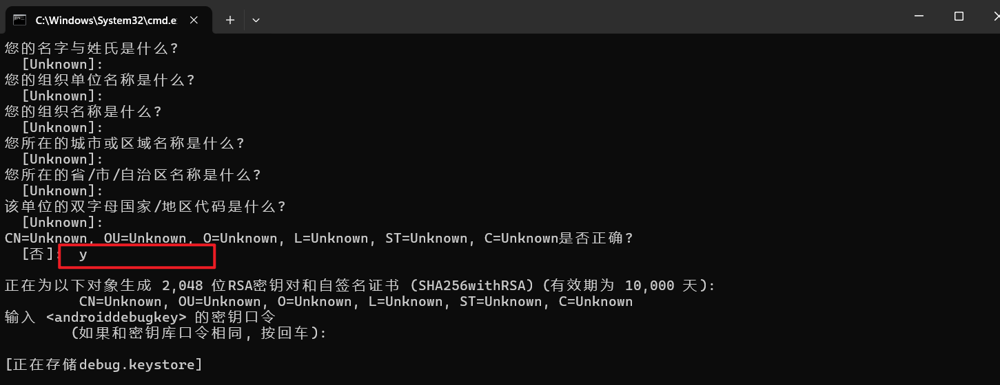
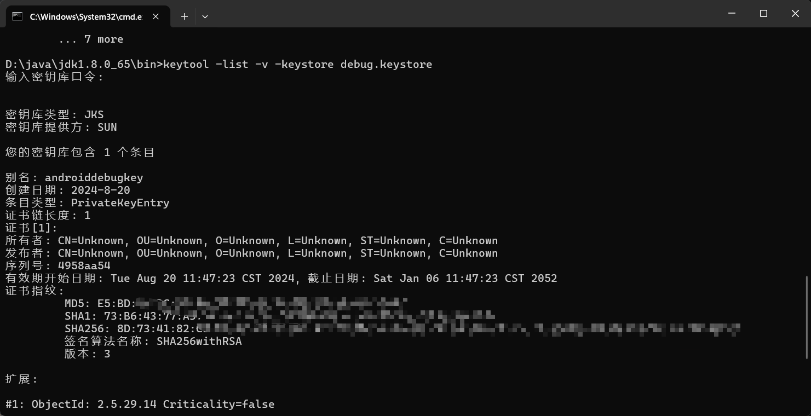

jdk来获取安卓的安全码SHA1

下载jdk，进入官网：https://www.oracle.com/



下载自己想要的jdk文件，安装



打开安装的jdk的位置，进入bin文件，然后地址栏输入cmd进入



打开cmd之后，输入以下命令，一般密钥口令就是`android`

```js
keytool -genkey -v -keystore debug.keystore -alias androiddebugkey -keyalg RSA -validity 10000
```



输入口令之后，就是一直回车，在最后那个的输入`y`就好了`CN=Unknown, OU=Unknown, O=Unknown, L=Unknown, ST=Unknown, C=Unknown是否正确?`



然后再次输入命令`keytool -list -v -keystore debug.keystore`，输入上面的口令密钥`android`，就可以拿到SHA1了

