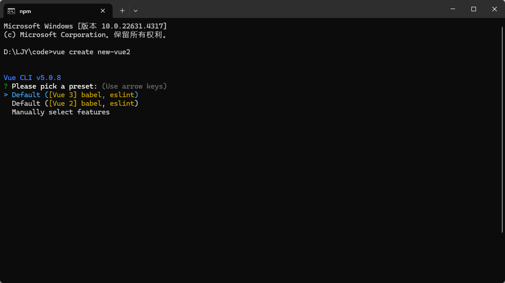
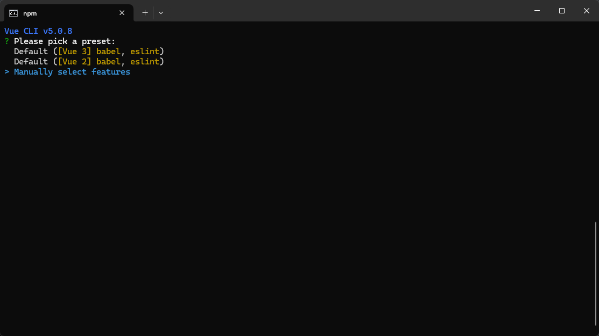
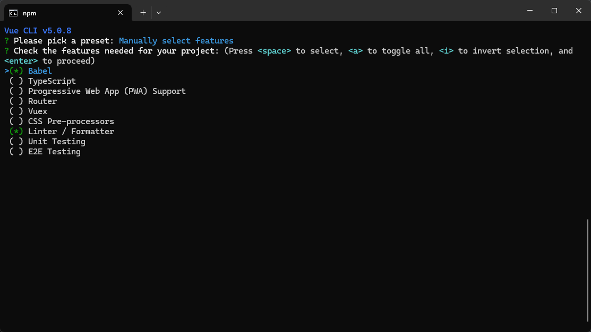
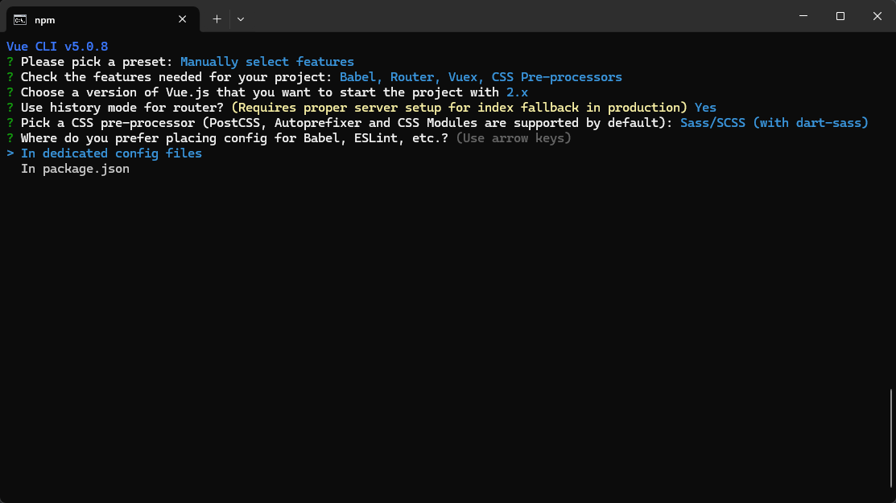
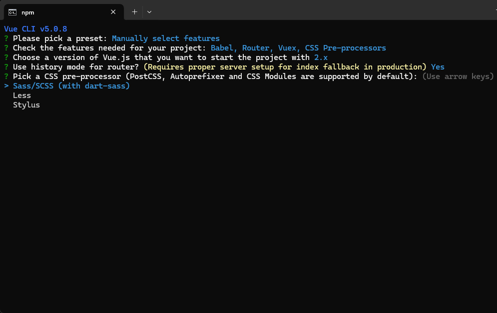

vue3.0创建

pnpm创建

```js
npm install -g pnpm

pnpm create vue
```

vite

```j
npm init vite@latest

npm create vite@latest
```


vue3 创建项目

```js
npm create vue@latest
```


vue2

*vue* init webpack 项目名


vue create 项目名称

输入命令之后，选择你想要的，vue几的项目，这里我们选择vue2的项目



然后你就会发现，直接安装的项目，会缺少很多东西，比如说路由模块，就是没有的，需要自己再次安装，所以我们选择第三个`Manually select features`，手动选择功能



回车之后出现这个，选择对应的插件，然后按空格键来选择，如果想去除eslint格式化，就把`linter / formatter`去除选择，选择完成后回车



这个一步选择，第一个



然后选择对应的插件内容




然后一直回车，就可以了
