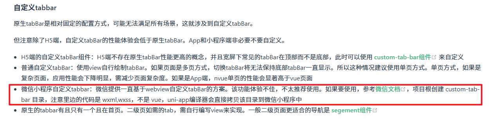
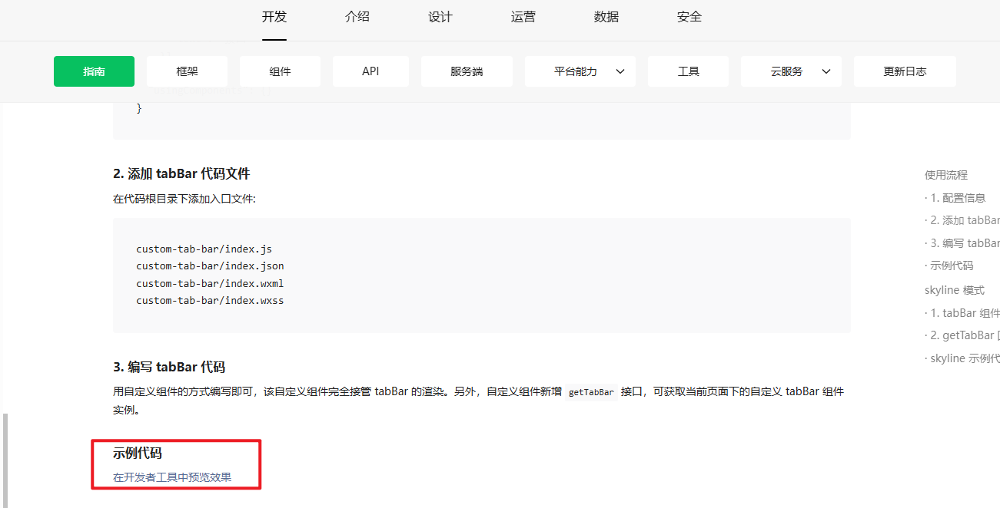
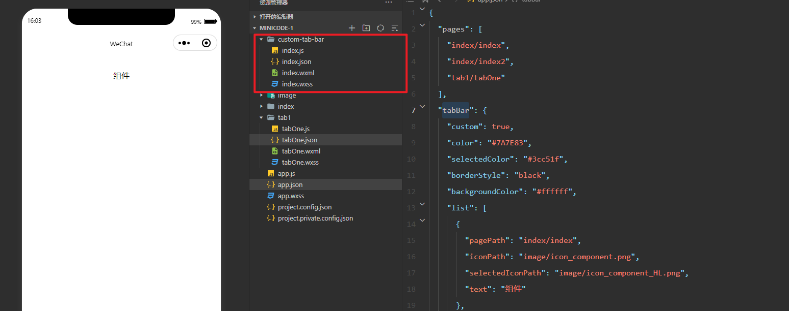
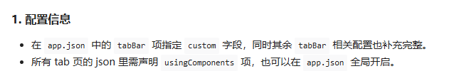

微信小程序自定义tabbar；禁用某个tab；修改某个tab的样式

原本使用本身的`tabBar`就已经很舒服了，很合适了的，但是总有一些脑洞大开的产品和客户，给你搞点多样式，没办法牛马就得去做咯，现在就给大家说说这个自定义`tabbar`的做法

无论使用uniapp开发微信小程序还是原生微信小程序的开发，都建议使用微信小程序本身的自定义tabbar组件来进行开发，连uniapp官网都说了使用这个自带的组件`custom-tab-bar`

微信小程序自定义tabbar组件文档：https://developers.weixin.qq.com/miniprogram/dev/framework/ability/custom-tabbar.html



可以看到，如果使用uniapp开发，可以直接使用`custom-tab-bar`，uniapp编辑器会自动把这个组件给复制过去，可以安心使用。

一、获取`custom-tab-bar`

打开上面的组件文档，找到下面的示例代码位置，点击预览效果，然后把打开的代码里面的组件（四个文件都要过去，直接把文件夹`custom-tab-bar`复制就好了）复制你的项目的根目录上面





二、配置新项目



我是在每个tab页进行添加的，

```js
{
    "page":[
        {
			"path": "page/component/index",
			"style": {
				"navigationBarTitleText": "tab1",
				"enablePullDownRefresh": false,
				"navigationStyle": "custom"
			},
			"usingComponents": {} //------------修改点1
		},
        .......
    ],
  "tabBar": {
    "custom": true, //----------------------------------------修改点2
    "color": "#000000",
    "selectedColor": "#000000",
    "backgroundColor": "#000000",
    "list": [{
      "pagePath": "page/component/index",
      "text": "tab1"
    }, {
      "pagePath": "page/API/index",
      "text": "tab2"
    },
    {
      "pagePath": "page/API/index",
      "text": "tab3"
    }
   ]
  },
}
```

还有一个很大的坑，在官网里面没有体现出来，但是不加的话，你就会发现你点击tab每次高显的都不是你的点击的tab。那就是要在每一个tab的页面加上以下的代码

```js
if (typeof this.$mp.page.getTabBar === 'function' && this.$mp.page.getTabBar()) {
	  	this.$mp.page.getTabBar().setData({
	  		selected: 0 //对应是那个页面就是多少  0 1 2 3，写死
	  	})
		this.$mp.page.getTabBar().init();//这是我为了触发非tab页面进来tab页面的时候custom-tab-bar组件没有刷新
}
```


三、修改`custom-tab-bar`

实现不同权限来进行展示不同的tab，写法比较直接。修改组件的index.js

```js
Component({
	data: {
		selected: 0,
		color: "#ccc",
		selectedColor: "3333cc",
		backgroundColor: "#ffffff",
		list: [{
                "pagePath": "index/index",
                "iconPath": "image/icon_component.png",
                "selectedIconPath": "image/icon_component_HL.png",
                "text": "组件"
              },
              {
                "pagePath": "index/index2",
                "iconPath": "image/icon_API.png",
                "selectedIconPath": "image/icon_API_HL.png",
                "text": "接口"
              },
              {
                "pagePath": "tab1/tabOne",
                "iconPath": "image/icon_API.png",
                "selectedIconPath": "image/icon_API_HL.png",
                "text": "切换"
              }
		],
		resultStataus: false,
	},
	attached() {
		this.init();
	},
	methods: {
		switchTab(e) {
			const data = e.currentTarget.dataset
			const url = data.path
			if (url == 'index/index') {//-------------------禁止某个页面被点击；如果你不想list被减少，只是想禁用可以这样使用
				if (this.data.resultStataus) {
					return
				}
			}
			wx.switchTab({
				url
			})
			this.setData({
				selected: data.index
			})
		},
		init() {
			try {
				var userInfo = wx.getStorageSync('loginInfo')
				if (userInfo) {
					let type = JSON.parse(userInfo).type
					let result = type == 1 ? true:false;  //根据不同的用户角色
					console.log('用户角色', result);
					this.setData({
						resultStataus: result
					})
					if (result) {
                        //少一个tab
						this.setData({
							list: [{
                                        "pagePath": "index/index",
                                        "iconPath": "image/icon_component.png",
                                        "selectedIconPath": "image/icon_component_HL.png",
                                        "text": "组件"
                                      },
                                      {
                                        "pagePath": "index/index2",
                                        "iconPath": "image/icon_API.png",
                                        "selectedIconPath": "image/icon_API_HL.png",
                                        "text": "接口"
                                      },
							]
						})
					} else {
                        //建议为false的时候也要把tablist再赋值一次，不然怕你切换登录的时候会导致页面有缓存没有更新list
						this.setData({
							list: [{
                                        "pagePath": "index/index",
                                        "iconPath": "image/icon_component.png",
                                        "selectedIconPath": "image/icon_component_HL.png",
                                        "text": "组件"
                                      },
                                      {
                                        "pagePath": "index/index2",
                                        "iconPath": "image/icon_API.png",
                                        "selectedIconPath": "image/icon_API_HL.png",
                                        "text": "接口"
                                      },
                                      {
                                        "pagePath": "tab1/tabOne",
                                        "iconPath": "image/icon_API.png",
                                        "selectedIconPath": "image/icon_API_HL.png",
                                        "text": "切换"
                                      }
							]
						})
					}
				}
			} catch (e) {

			}
		}
	}
})
```

如果你要禁用某一个tab就可以在点击tab里面加一个判断

```js
if (url == 'index/index') {//-------------------禁止某个页面被点击；如果你不想list被减少，只是想禁用可以这样使用
    if (this.data.resultStataus) {
        return
    }
}
wx.switchTab({
    url
})
```

如果你想把禁用的这个tab，把图标置灰，文字颜色也进行修改

```js
//图标置灰，最直接方法就是上面判断用户类型赋值list的时候，换一个在图标
{
    {
        "pagePath": "tab1/tabOne",
        "iconPath": "image/icon_API_none.png", //  ---------------直接换图标
        "selectedIconPath": "image/icon_API_HL.png",
        "text": "切换"
      }
}
//修改文字颜色。在组件的index.wxml的页面直接加判断
<view style="color: {{(index == 1 && resultStataus)?'#C9CDD4':(selected === index ? selectedColor : color)}}">{{item.text}}</view>
// index == 1  你想要处理的tab的下标
// 是否要修改tab的判断  resultStataus  true  false  看上面的代码
```

