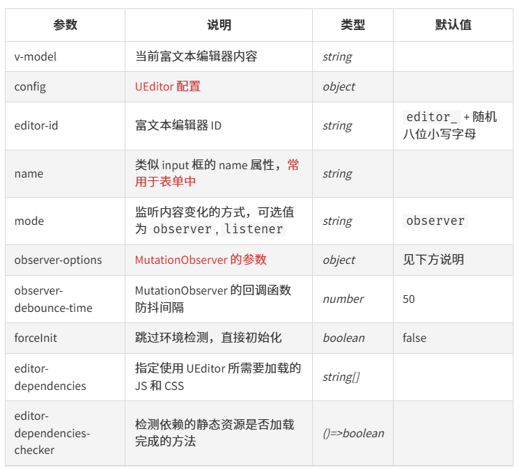

富文本插件`vue-ueditor-wrap`

地址：https://github.com/HaoChuan9421/vue-ueditor-wrap

npm：https://www.npmjs.com/package/vue-ueditor-wrap?activeTab=readme

安装

```js
npm i vue-ueditor-wrap //版本 "vue-ueditor-wrap": "^2.5.6",
```

把`ueditor`文件放在静态资源里面


配置全局组件

```js
//main.js
import VueUeditorWrap from 'vue-ueditor-wrap'
Vue.component('vue-ueditor-wrap', VueUeditorWrap)
```

页面使用

```html
<vue-ueditor-wrap v-model="form.messageContent" :config="myConfig"></vue-ueditor-wrap>
//form.messageContent  绑定值
//config  配置文件
```



`myConfig.js`配置文件

```js
//UEDITOR_HOME_URL  很重要的配置，要是路径不对会导致页面富文本无法展示,理论上默认`/UEditor/`就好了，如果你的项目做了二级分目录部署，就自己改路径

// 百度富文本配置项
//let url = process.env.NODE_ENV === 'development' ? '/UEditor/' : '/pulic/UEditor/'
export const ueditorConfig = {
    //是否开启字数统计
    wordCount: true,
    //允许输入的最大字符数
    maximumWords: 1000,
    // 编辑器不自动被内容撑高
    autoHeightEnabled: false,
    // 初始容器高度
    initialFrameHeight: 240,
    // 初始容器宽度
    initialFrameWidth: '100%',
    // 上传文件接口
    // serverUrl: '/ueditorUploads',
    // UEditor 资源文件的存放路径，通常Nuxt项目设置为/UEditor/即可
    UEDITOR_HOME_URL: "/UEditor/",  
    // 配合最新编译的资源文件，你可以实现添加自定义Request Headers,详情https://github.com/HaoChuan9421/ueditor/commits/dev-1.4.3.3
    headers: {
        Authorization: `Bearer token`,
    },
    // 禁止自动保存配置
    disableAutoSaveConfig: true,
    readonly: false,
    focus: true,
    toolbars: [
        [
            // 'anchor', //锚点
            // 'undo', //撤销
            // 'redo', //重做
            'bold', //加粗
            'indent', //首行缩进
            // 'snapscreen', //截图
            'italic', //斜体
            'underline', //下划线
            'strikethrough', //删除线
            'subscript', //下标
            'fontborder', //字符边框
            'superscript', //上标
            // 'formatmatch', //格式刷
            // 'source', //源代码
            // 'blockquote', //引用
            // 'pasteplain', //纯文本粘贴模式
            'selectall', //全选
            // 'print', //打印
            // 'preview', //预览
            // 'horizontal', //分隔线
            // 'removeformat', //清除格式
            // 'time', //时间
            // 'date', //日期
            // 'unlink', //取消链接
            // 'insertrow', //前插入行
            // 'insertcol', //前插入列
            // 'mergeright', //右合并单元格
            // 'mergedown', //下合并单元格
            // 'deleterow', //删除行
            // 'deletecol', //删除列
            // 'splittorows', //拆分成行
            // 'splittocols', //拆分成列
            // 'splittocells', //完全拆分单元格
            // 'deletecaption', //删除表格标题
            'inserttitle', //插入标题
            'mergecells', //合并多个单元格
            'deletetable', //删除表格
            'cleardoc', //清空文档
            'insertparagraphbeforetable', //"表格前插入行"
            // 'insertcode', //代码语言
            'fontfamily', //字体
            'fontsize', //字号
            // 'paragraph', //段落格式
            // 'simpleupload', //单图上传
            // 'insertimage', //多图上传
            // 'edittable', //表格属性
            // 'edittd', //单元格属性
            'link', //超链接
            // 'emotion', //表情
            // 'spechars', //特殊字符
            // 'searchreplace', //查询替换
            // 'map', //Baidu地图
            // 'gmap', //Google地图
            // 'insertvideo', //视频
            // 'help', //帮助
            'justifyleft', //居左对齐
            'justifyright', //居右对齐
            'justifycenter', //居中对齐
            'justifyjustify', //两端对齐
            'forecolor', //字体颜色
            // 'backcolor', //背景色
            'insertorderedlist', //有序列表
            'insertunorderedlist', //无序列表
            'fullscreen', //全屏
            'directionalityltr', //从左向右输入
            'directionalityrtl', //从右向左输入
            'rowspacingtop', //段前距
            'rowspacingbottom', //段后距
            // 'pagebreak', //分页
            // 'insertframe', //插入Iframe
            // 'imagenone', //默认
            // 'imageleft', //左浮动
            // 'imageright', //右浮动
            // 'attachment', //附件
            // 'imagecenter', //居中
            // 'wordimage', //图片转存
            'lineheight', //行间距
            // 'edittip ', //编辑提示
            // 'customstyle', //自定义标题
            // 'autotypeset', //自动排版
            // 'webapp', //百度应用
            'touppercase', //字母大写
            'tolowercase', //字母小写
            // 'background', //背景
            // 'template', //模板
            // 'scrawl', //涂鸦
            // 'music', //音乐
            // 'inserttable', //插入表格
            // 'drafts', // 从草稿箱加载
            // 'charts', // 图表
        ]
    ],
}
```

