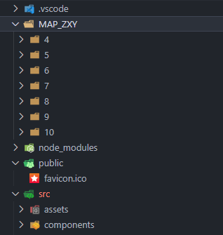

离线地图的使用

```js
在index.html引入
<script src="/amap/AMap.js"></script>
```

页面



```js
<script setup>
import { onMounted } from 'vue'
const mapUrl = '.'  //看路径情况来添加
let map = null
const startLngLat = [82.56031,45.155809]
onMounted(() => {
  console.log('onMounted')
  setTimeout(() => init(), 3000)
})
const init = () => {
  const layers = [
    new AMap.TileLayer({
        // 瓦片要放在根目录，就是和public同级-------
      getTileUrl: function (x, y, z) {
        return `${mapUrl}/MAP_ZXY/${z}/${x}/${y}/tile.png`
      },
      opacity: 1,
      zIndex: 99
    })
  ]
  map = new AMap.Map('container', {
    viewMode: '2D',
    zoom: 10,
    zooms: [6, 10],
    center: startLngLat,
    layers: layers
  })

  var marker = null
  const lineArr = [
      [82.56031,45.155809],
      [82.56031,45.146676],
      [82.56031,45.103604],
      [82.56771,45.073565],
      [82.575109,45.042203],
    ]
  marker = new AMap.Marker({
    map: map,
    position: [116.478935, 39.997761],
    icon: "https://a.amap.com/jsapi_demos/static/demo-center-v2/car.png",
    offset: new AMap.Pixel(-13, -26),
  });

  // 绘制轨迹
  var polyline = new AMap.Polyline({
    map: map,
    path: lineArr,
    showDir: true,
    strokeColor: "#28F",  //线颜色
    // strokeOpacity: 1,     //线透明度
    strokeWeight: 6,      //线宽
    // strokeStyle: "solid"  //线样式
  });

  var passedPolyline = new AMap.Polyline({
    map: map,
    strokeColor: "#AF5",  //线颜色
    strokeWeight: 6,      //线宽
  });

  marker.moveAlong(lineArr, {
      // 每一段的时长
      duration: 500,//可根据实际采集时间间隔设置
      // JSAPI2.0 是否延道路自动设置角度在 moveAlong 里设置
      autoRotation: true,
  });
  AMap.plugin(['AMap.ToolBar'], () => {
    map.addControl(new AMap.ToolBar())
  })

}


</script>

<template>
  <div class="map">
    <div id="container"></div>
  </div>
</template>

<style scoped>
#container {
  width: 100vw;
  height: 100vh;
}
</style>

```

